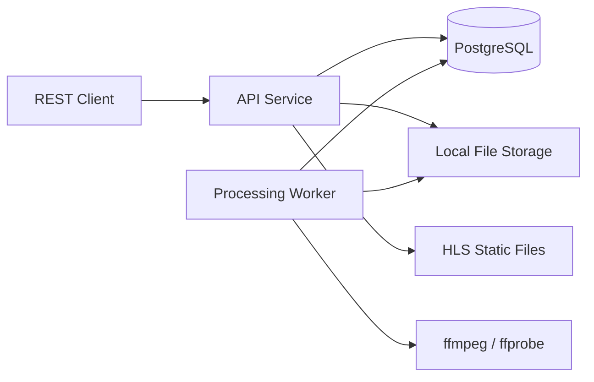
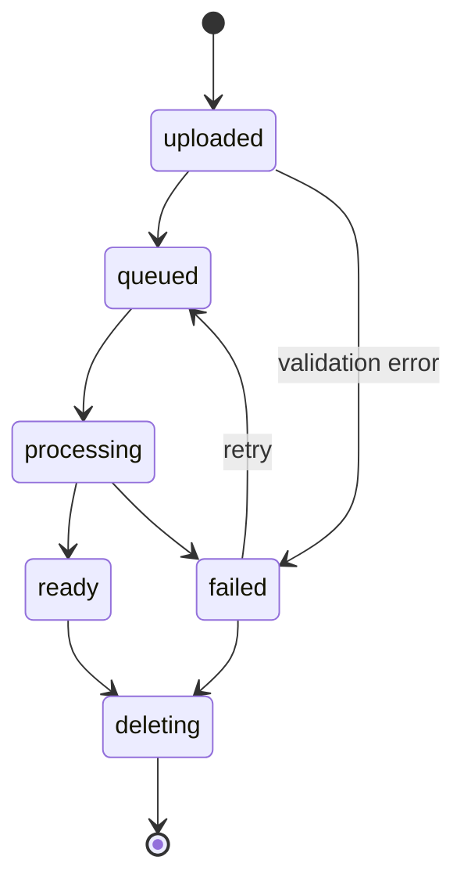

# Системный аналитический отчет
## Медиагалерея + CMS с асинхронной обработкой видео (HLS/ffmpeg)

**Роль:** Агент-Аналитик / System Analyst  
**Фаза:** Phase 1 — детальный системный анализ  
**Стек:** Go, PostgreSQL, ffmpeg, Docker Compose, Clean Architecture / DDD, API-First REST

---

## 1. Резюме

Проектируемый сервис представляет собой два логических контекста:

1. **Media Gallery** — загрузка, валидация, хранение и асинхронная обработка медиафайлов.
2. **CMS Blocks** — управление динамическими блоками страниц с привязкой медиафайлов.

Ключевая сложность — не CRUD-операции, а **надежный асинхронный пайплайн обработки видео**:
- конкурентное выполнение ffmpeg-процессов;
- гарантированная консистентность между PostgreSQL и файловым хранилищем;
- отсутствие частично сгенерированных HLS-стримов;
- устойчивость к падениям воркеров и перезапускам.

Ниже приведен детальный анализ ограничений, race conditions, допущений MVP и критериев готовности.

---

## 2. Исходные требования

| № | Требование |
|---|------------|
| 1 | Загрузка и валидация изображений JPEG/PNG и видео MP4 |
| 2 | Асинхронная конвертация MP4 в HLS: `master.m3u8` + `.ts`-сегменты |
| 3 | Гибридное хранение: PostgreSQL для метаданных, локальный диск для бинарных файлов |
| 4 | CMS: привязка медиафайлов к динамическим блокам страниц |
| 5 | API-First REST, валидация через Postman/Swagger, фронтенд вне скоупа |
| 6 | Clean Architecture / DDD |
| 7 | Деплой через Docker Compose |

---

## 3. Архитектурный контекст и ограничения

### 3.1. Чистая архитектура

Сервис должен быть разделен на слои:

```
interfaces/       — HTTP handlers, DTO, middleware
application/      — use cases, application services, ports
domain/           — entities, value objects, domain events, repository interfaces
infrastructure/   — PostgreSQL, local FS, ffmpeg runner, job queue
```

Ограничения:
- **Domain-слой не должен зависеть** от HTTP, SQL, ffmpeg и файловой системы.
- Взаимодействие с БД и диском — только через интерфейсы-порты.
- Use case не должен запускать ffmpeg напрямую — только через порт `VideoProcessor`.
- Транзакции и работа с файлами должны быть разделены на компенсируемые шаги.

### 3.2. DDD-контексты

Выделяются два ограниченных контекста:

1. **Media Context**  
   Агрегат `MediaAsset`:
    - `ID`
    - `OriginalFileName`
    - `MediaType` (`image/jpeg`, `image/png`, `video/mp4`)
    - `Status` (`uploaded`, `queued`, `processing`, `ready`, `failed`, `deleting`)
    - `StoragePath` — путь к оригиналу
    - `HlsPath` — путь к HLS-плейлисту
    - `SizeBytes`, `ChecksumSHA256`
    - `Metadata` — ширина, высота, длительность, кодек
    - `CreatedAt`, `UpdatedAt`

   Агрегат `ProcessingJob`:
    - `ID`
    - `AssetID`
    - `Status`
    - `Attempt`
    - `LeaseOwner`
    - `LeaseExpiresAt`
    - `Error`
    - `CreatedAt`, `StartedAt`, `FinishedAt`

2. **CMS Context**  
   Агрегат `ContentBlock`:
    - `ID`
    - `PageKey`
    - `Type` (`text`, `carousel`, `reviews`, `about`)
    - `Data` — JSONB
    - `SortOrder`

   Связь `BlockMediaLink`:
    - `BlockID`
    - `AssetID`
    - `Position`

### 3.3. Хранение

PostgreSQL:
- источник истины для метаданных и статусов;
- хранение JSONB-данных CMS-блоков;
- таблица `processing_jobs` используется как надежная очередь.

Локальный диск:
- `originals/{assetID}/{filename}`;
- `hls/{assetID}/master.m3u8`;
- `hls/{assetID}/segments/seg_00001.ts`.

Требования к файловому хранилищу:
- интерфейс `FileStorage` должен быть заменяемым на S3;
- все файлы пишутся во временную директорию, затем атомарно перемещаются в финальную;
- пути генерируются только из UUID, без пользовательских имен;
- запрещен path traversal;
- файлы HLS отдаются как статические файлы с корректным `Content-Type`.

---

## 4. High-level архитектура



### 4.1. Компоненты

| Компонент | Назначение |
|-----------|------------|
| **API Service** | REST API: загрузка, метаданные, статусы, CMS, отдача HLS |
| **Processing Worker** | Фоновая обработка видео: чтение очереди, запуск ffmpeg |
| **PostgreSQL** | Метаданные, статусы, CMS, очередь задач |
| **Local Storage** | Оригиналы, HLS-стримы, временные файлы |
| **ffmpeg/ffprobe** | Внешние процессы: валидация, конвертация |

### 4.2. Основные потоки

#### Загрузка медиафайла

```
Client → API → validate → save original → DB insert → enqueue job → 202 Accepted
```

#### Обработка видео

```
Worker → claim job → ffprobe → ffmpeg HLS → temp dir → atomic rename → DB status=ready
```

#### Отдача HLS

```
Client → API → static file handler → /hls/{assetID}/master.m3u8
```

---

## 5. Асинхронный пайплайн обработки видео

### 5.1. Машина состояний



### 5.2. Очередь задач

Для MVP очередь строится на PostgreSQL:

```sql
UPDATE processing_jobs
SET status = 'processing',
    lease_owner = $1,
    lease_expires_at = now() + interval '5 minutes'
WHERE id = (
    SELECT id
    FROM processing_jobs
    WHERE status = 'queued'
    ORDER BY created_at
    FOR UPDATE SKIP LOCKED
    LIMIT 1
)
RETURNING *;
```

Правила:
- `FOR UPDATE SKIP LOCKED` гарантирует, что один job не будет взят двумя воркерами.
- Worker обязан продлевать lease (heartbeat) во время долгого ffmpeg.
- Если lease истек, другой worker может перехватить задачу.
- Повторная обработка должна быть идемпотентной: если HLS уже сгенерирован, не создавать дубликаты.

### 5.3. Управление ffmpeg-процессом

Запуск через `exec.CommandContext`.

Обязательные меры:
- контекст с таймаутом;
- `Setpgid` для создания process group;
- при отмене: `SIGTERM` → ожидание → `SIGKILL`;
- обязательный `cmd.Wait()` для предотвращения zombie-процессов;
- чтение `stderr` и `stdout` в отдельные ограниченные буферы;
- прогресс ffmpeg можно получать через `-progress pipe:1` и парсить.

Рекомендуемые ограничения ffmpeg:
- `-threads` ограничить;
- `-preset veryfast`;
- `-maxrate`, `-bufsize`;
- `-hls_time 4`;
- `-hls_list_size 0`;
- `-hls_segment_filename` в temp-директорию.

### 5.4. Валидация

Валидация должна быть двухэтапной:

1. **При загрузке:**
    - расширение файла;
    - `Content-Type`;
    - magic bytes через `http.DetectContentType`;
    - для видео — `ffprobe` для проверки контейнера MP4.

2. **Перед обработкой:**
    - `ffprobe -v error -print_format json -show_format -show_streams`;
    - проверка длительности, разрешения, кодеков.

---

## 6. Race conditions и конкурентные сценарии

| # | Сценарий | Риск | Mitigation |
|---|----------|------|------------|
| 1 | Два воркера берут один job | Двойная обработка, гонка за файлы | `FOR UPDATE SKIP LOCKED`, атомарный claim |
| 2 | Worker упал во время ffmpeg | Job завис в статусе `processing` | Lease expiration + heartbeat + requeue |
| 3 | Удаление медиафайла во время обработки | Воркер пишет в удаленную директорию | Статус `deleting`, проверка статуса в worker, отмена контекста |
| 4 | Частично записанный HLS виден клиенту | Битый плейлист/сегменты | Генерация в temp dir → атомарный rename финальной директории |
| 5 | Файл сохранен, но запись в БД не удалась | Orphan-файл на диске | Сохранение файла → DB insert → при ошибке cleanup файла |
| 6 | Запись в БД удалась, но файл удалить не удалось | Dangling metadata | Status `deleting` → delete files → delete DB row; при ошибке — retry |
| 7 | CMS-блок ссылается на не готовый медиафайл | Битые карусели на проде | API проверяет `status = ready` перед привязкой |
| 8 | Удаление медиафайла, на который ссылается CMS | Висячая ссылка | `ON DELETE RESTRICT` или мягкое удаление |
| 9 | Одновременная загрузка одного и того же файла | Дубликаты | В MVP дедупликация не обязательна; можно добавить по SHA256 |
| 10 | Переполнение диска во время ffmpeg | Падение обработки, повреждение файлов | Мониторинг свободного места, лимиты на размер, cleanup temp |
| 11 | Зависший ffmpeg-процесс | Утечка CPU/памяти | `CommandContext` с таймаутом, kill process group |
| 12 | Повторный claim после lease expiry | Дублирование HLS | Идемпотентность: если temp/final HLS уже существует, проверить и завершить |
| 13 | Чтение HLS во время обновления файлов | Разрыв стрима | Для MVP — HLS не перезаписывается; reprocess создает новую версию |

---

## 7. Ключевые неочевидные риски

1. **Согласованность БД и файловой системы**  
   Это главный источник багов. Нельзя использовать распределенные транзакции между PostgreSQL и диском. Требуются компенсирующие операции и фоновая реконсиляция.

2. **Управление жизненным циклом ffmpeg**  
   ffmpeg — внешний процесс. Без `Wait()` и kill process group возможны zombie-процессы. Без таймаутов — зависание воркера.

3. **Атомарность HLS-результата**  
   HLS состоит из десятков/сотен файлов. Клиент не должен видеть частично записанную директорию. Нужен temp dir + rename.

4. **Репроцессинг и версионирование**  
   Если понадобится перегенерировать HLS, перезапись старых сегментов может сломать активные стримы. В MVP — reprocess не входит в скоуп.

5. **Очередь на PostgreSQL**  
   При росте нагрузки таблица `processing_jobs` может стать узким местом. Для MVP приемлемо, но нужна индексация по `status, created_at`.

6. **Доступ к HLS**  
   Если HLS отдается через API без кэширования, это создаст лишнюю нагрузку. Для MVP достаточно статического file handler, но в production лучше вынести в nginx/S3/CDN.

7. **Безопасность загрузки**  
   Загрузка файлов — стандартный вектор атак. Обязательны: проверка MIME, magic bytes, размер, path traversal.

8. **Отсутствие фронтенда**  
   API-first предполагает, что контракт API стабилен. Необходимо зафиксировать OpenAPI-схему до начала разработки.

---

## 8. Технические допущения MVP

1. **Один экземпляр воркера** в Docker Compose. Архитектура поддерживает горизонтальное масштабирование, но для MVP достаточно 1–2 реплик.
2. **Очередь — PostgreSQL**, без Kafka/RabbitMQ.
3. **HLS — одно качество** (single rendition). Мастер-плейлист генерируется, но содержит один вариант.
4. **Без дедупликации** медиафайлов по контенту.
5. **Без reprocess** существующих видео. Для повторной обработки — повторная загрузка.
6. **Локальное хранение** как единственный бэкенд. Интерфейс `FileStorage` спроектирован с учетом будущей миграции на S3.
7. **Без версионирования HLS**. HLS-файлы не перезаписываются после генерации.
8. **CMS без версионирования и публикаций**. Контент сохраняется сразу в боевом виде.
9. **Аутентификация** — статический API key или внутренняя сеть. OAuth/JWT вынесены за пределы MVP.
10. **Максимальный размер видео** — 500 MB, длительность — до 30 минут.
11. **HLS отдается через API** статическим file handler. Внешний nginx/CDN — вне скоупа.
12. **PostgreSQL и файлы на одном Docker volume** для простоты деплоя.
13. **Ретраи обработки** — максимум 3 попытки, затем статус `failed`.
14. **Без WebSocket/SSE** для нотификаций. Клиент опрашивает статус через REST.

---

## 9. Definition of Done для релиза

### 9.1. Функциональные критерии

- [ ] Реализован `POST /v1/media` для загрузки JPEG/PNG/MP4.
- [ ] Валидация по расширению, `Content-Type`, magic bytes.
- [ ] Для видео запускается `ffprobe` и проверяется MP4-контейнер.
- [ ] После загрузки создается запись в `media_assets` и `processing_jobs`.
- [ ] Worker забирает job из очереди и запускает ffmpeg.
- [ ] HLS генерируется в temp-директорию и атомарно перемещается в финальную.
- [ ] После успешной обработки статус меняется на `ready`.
- [ ] При ошибке статус меняется на `failed`, ошибка сохраняется в БД.
- [ ] `GET /v1/media/{id}` возвращает метаданные и статус.
- [ ] `GET /v1/media` поддерживает фильтрацию по статусу и типу.
- [ ] `DELETE /v1/media/{id}` помечает файл как `deleting` и удаляет файлы с диска.
- [ ] HLS доступен по статическому URL и корректно проигрывается.
- [ ] CMS: реализованы CRUD-эндпоинты для блоков.
- [ ] CMS: привязка медиафайлов к блокам проверяет `status = ready`.
- [ ] CMS: удаление медиафайла, используемого в блоке, запрещено или обрабатывается мягко.

### 9.2. Нефункциональные критерии

- [ ] Код соответствует Clean Architecture: domain не зависит от инфраструктуры.
- [ ] Все внешние зависимости — через интерфейсы-порты.
- [ ] Конфигурация через переменные окружения.
- [ ] Структурированное логирование с request ID.
- [ ] Метрики: количество загруженных файлов, время обработки, ошибки.
- [ ] Таймауты на все внешние процессы: ffmpeg, ffprobe.
- [ ] Обработка завершения работы: graceful shutdown, отмена активных ffmpeg-процессов.
- [ ] Нет утечек горутин и файловых дескрипторов.
- [ ] API покрыт OpenAPI/Swagger-документацией.
- [ ] Все ошибки имеют машиночитаемые коды и человекочитаемые сообщения.

### 9.3. Тестирование

- [ ] Юнит-тесты domain-логики.
- [ ] Юнит-тесты use cases с моками портов.
- [ ] Интеграционные тесты с PostgreSQL.
- [ ] Интеграционные тесты с реальным ffmpeg на коротком видео.
- [ ] Тесты на race conditions: конкурентный claim job.
- [ ] Тесты на отмену ffmpeg по контексту.
- [ ] Тесты на атомарность HLS: не виден частичный результат.
- [ ] Контрактные тесты API.
- [ ] E2E сценарий: загрузка MP4 → обработка → отдача HLS.
- [ ] Нагрузочный тест загрузки 10 одновременных видео.

### 9.4. Деплой и документация

- [ ] Docker Compose поднимает: `api`, `worker`, `postgres`.
- [ ] Миграции БД применяются автоматически при старте.
- [ ] Healthcheck у API и worker.
- [ ] README с инструкцией запуска.
- [ ] Документация API в Swagger UI.
- [ ] Описание архитектуры и flow обработки.
- [ ] Документированные переменные окружения.

### 9.5. Безопасность

- [ ] Загрузка файлов защищена от path traversal.
- [ ] MIME-тип проверяется по содержимому, а не только по заголовку.
- [ ] Лимит на размер загрузки enforced на уровне API.
- [ ] Статический file handler не отдает файлы вне HLS-директории.
- [ ] API key на всех endpoints.
- [ ] Нет секретов в репозитории.

---

## 10. Рекомендации по порядку реализации

1. Зафиксировать OpenAPI-контракт.
2. Реализовать domain-слой и интерфейсы портов.
3. Реализовать загрузку оригиналов и хранение в PostgreSQL.
4. Реализовать очередь на PostgreSQL с `SKIP LOCKED`.
5. Реализовать воркер с управлением ffmpeg.
6. Реализовать отдачу HLS.
7. Реализовать CMS-блоки.
8. Добавить observability, тесты, Docker Compose.

---

## 11. Заключение

Проект технически реализуем в рамках MVP. Основные риски сосредоточены в асинхронной обработке видео и согласованности между БД и файловой системой. При строгом соблюдении описанных паттернов — атомарный claim задач, управление ffmpeg через context, temp-директории и атомарный rename — сервис может быть доведен до production-ready уровня. Миграция на S3 в будущем не потребует переписывания доменного слоя, если сейчас корректно изолировать файловое хранилище за интерфейсом.